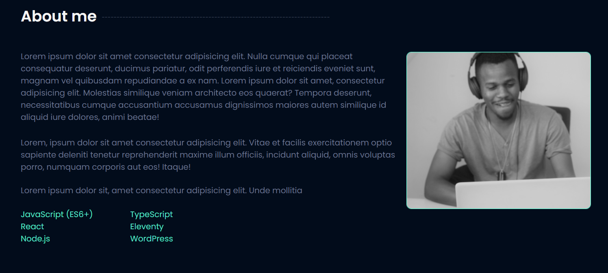

# Portfolio-website
Portfolioga oxshash website

<div id="top"></div>

[![Contributors][contributors-shield]][contributors-url]
[![Forks][forks-shield]][forks-url]
[![Stargazers][stars-shield]][stars-url]
[![Issues][issues-shield]][issues-url]
[![MIT License][license-shield]][license-url]
[![LinkedIn][linkedin-shield]][linkedin-url]

<!-- PROJECT LOGO -->
<br />
<div align="center">
<!-- Agar logo kerak bolmasa ochirib tashlang  -->
  <a href="https://github.com/AsilbekYoldashaliyev">
    <!--  -->
  </a>
  
<!-- Sizning proyektingizni nomi -->
<h3 align="center">My Portfolio</h3>

<!-- Qisqacha proyektingiz haqida informatsiya -->
  <p align="center">
   This portfolio about Stephan Gachoka
    <br />
    <a href="https://github.com/AsilbekYoldashaliyev"><strong>Explore the docs »</strong></a>
    <br />
    <br />
    <a href="https://github.com/AsilbekYoldashaliyev">View Demo</a>
    ·
    <a href="https://github.com/AsilbekYoldashaliyev">Report Bug</a>
    ·
    <a href="https://github.com/AsilbekYoldashaliyev">Request Feature</a>
  </p>
</div>

<!-- TABLE OF CONTENTS -->
<details>
  <summary>Table of Contents</summary>
  <ol>
    <li>
      <a href="#about-the-project">About The Project</a>
      <ul>
        <li><a href="#built-with">Built With</a></li>
      </ul>
    </li>
    <li>
      <a href="#getting-started">Getting Started</a>
      <ul>
        <li><a href="#prerequisites">Prerequisites</a></li>
        <li><a href="#installation">Installation</a></li>
      </ul>
    </li>
    <li><a href="#usage">Usage</a></li>
    <li><a href="#roadmap">Roadmap</a></li>
    <li><a href="#contributing">Contributing</a></li>
    <li><a href="#license">License</a></li>
    <li><a href="#contact">Contact</a></li>
    <li><a href="#acknowledgments">Acknowledgments</a></li>
  </ol>
</details>

<!-- ABOUT THE PROJECT -->

## About The Project

[![Product Name Screen Shot][product-screenshot]](https://example.com)

<!-- Proyektingiz haqida ma'lumot kamida 3ta gapdan tashkil topsin -->

Here's a blank template to get started: To avoid retyping too much info. Do a search and replace with your text editor for the following: `AsilbekYoldashaliyev`, `personal-budget-planner`, `twitter_handle`, `linkedin_username`, `email_client`, `yoldashaliyev0303@gmail.com`, `project_title`, `project_description`

<p align="right">(<a href="#top">back to top</a>)</p>

### Built With

<!-- Qaysi dasturlash tillaridan tashkil topgani haqida yozing ma'lumot bilan -->

Description....

<!-- Dasturlash tillarini o'zingizni dasturingizga qarab to'g'rilang o'zgartiring -->

<!-- MISOL:
- [Dastur nomi](shu dastur haqida link)
 -->

- [Next.js](https://nextjs.org/)
- [React.js](https://reactjs.org/)
- [Vue.js](https://vuejs.org/)
- [Angular](https://angular.io/)
- [Svelte](https://svelte.dev/)
- [Laravel](https://laravel.com)
- [Bootstrap](https://getbootstrap.com)
- [JQuery](https://jquery.com)

<p align="right">(<a href="#top">back to top</a>)</p>

<!-- GETTING STARTED -->
<!-- qanday qilib ornatish haqida ma'lumot -->

## Getting Started

This is an example of how you may give instructions on setting up your project locally.
To get a local copy up and running follow these simple example steps.

### Prerequisites

This is an example of how to list things you need to use the software and how to install them.

- npm
  ```sh
  npm install npm@latest -g
  ```

### Installation

<!-- Agar bu qismini tushunmasangiz menga murojat qiling -->

1. Get a free API Key at [https://example.com](https://example.com)
2. Clone the repo
   ```sh
   git clone https://github.com/rustamxon7/personal-budget-planner.git
   ```
3. Install NPM packages
   ```sh
   npm install
   ```
4. Enter your API in `config.js`
   ```js
   const API_KEY = 'ENTER YOUR API';
   ```

<p align="right">(<a href="#top">back to top</a>)</p>

<!-- USAGE EXAMPLES -->

## Usage

<!--
Qanday ishlatish haqida ma'lumot
 -->

 <!-- Agar bu qismini tushunmasangiz menga murojat qiling -->

Use this space to show useful examples of how a project can be used. Additional screenshots, code examples and demos work well in this space. You may also link to more resources.

_For more examples, please refer to the [Documentation](https://example.com)_

<p align="right">(<a href="#top">back to top</a>)</p>

<!-- ROADMAP -->

## Roadmap

- [ ] Feature 1
- [ ] Feature 2
- [ ] Feature 3
  - [ ] Nested Feature

See the [open issues](https://github.com/AsilbekYoldashaliyev/issues) for a full list of proposed features (and known issues).

<p align="right">(<a href="#top">back to top</a>)</p>

<!-- CONTRIBUTING -->

## Contributing

<!-- Proyektingizda kimlar qatnachga shu kishilarni ishmini va githubini yozing -->
<!-- Bu qismini qoldirishingiz mumkin -->

Rustam Tolipov - [@signing githubingiz](github linki) - email@example.com

<p align="right">(<a href="#top">back to top</a>)</p>

<!-- LICENSE -->

## License

Distributed under the MIT License. See `LICENSE.txt` for more information.

<p align="right">(<a href="#top">back to top</a>)</p>

<!-- CONTACT -->

## Contact

<!-- proyektingiz linki, githubdagi -->

Your Name - [@twitter_handle](https://twitter.com/twitter_handle) - email@email_client.com

Project Link: [https://github.com/AsilbekYoldashaliyev](https://github.com/AsilbekYoldashaliyev)

<p align="right">(<a href="#top">back to top</a>)</p>

<!-- ACKNOWLEDGMENTS -->

## Acknowledgments

- []()
- []()
- []()

<p align="right">(<a href="#top">back to top</a>)</p>

<!-- MARKDOWN LINKS & IMAGES -->
<!-- https://www.markdownguide.org/basic-syntax/#reference-style-links -->

[contributors-shield]: https://img.shields.io/github/contributors/rustamxon7/personal-budget-planner.svg?style=for-the-badge
[contributors-url]: https://github.com/rustamxon7/personal-budget-planner/graphs/contributors
[forks-shield]: https://img.shields.io/github/forks/rustamxon7/personal-budget-planner.svg?style=for-the-badge
[forks-url]: https://github.com/rustamxon7/personal-budget-planner/network/members
[stars-shield]: https://img.shields.io/github/stars/rustamxon7/personal-budget-planner.svg?style=for-the-badge
[stars-url]: https://github.com/rustamxon7/personal-budget-planner/stargazers
[issues-shield]: https://img.shields.io/github/issues/rustamxon7/personal-budget-planner.svg?style=for-the-badge
[issues-url]: https://github.com/rustamxon7/personal-budget-planner/issues
[license-shield]: https://img.shields.io/github/license/rustamxon7/personal-budget-planner.svg?style=for-the-badge
[license-url]: https://github.com/rustamxon7/personal-budget-planner/blob/master/LICENSE.txt
[linkedin-shield]: https://img.shields.io/badge/-LinkedIn-black.svg?style=for-the-badge&logo=linkedin&colorB=555
[linkedin-url]: https://linkedin.com/in/linkedin_username
[product-screenshot]: images/screenshot.png
